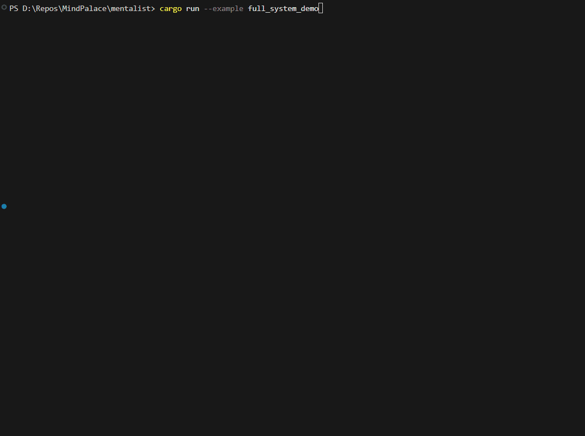

# Mentalist (DeepAgent Middleware)



The **Mentalist** is a high-performance, production-ready execution environment for autonomous agents in Rust. It implements the **Agent = Model + Harness** paradigm from the **DeepAgent methodology**, providing the necessary infrastructure to make LLM-based agents reliable, stateful, and secure.

## 🚀 Key Pillars

### 1. Execution Lifecycle Hooks (Interceptors)
The harness provides a strict "Interceptor" pattern through four primary hooks:
- **`before_ai_call`**: Optimize the prompt context (integrated with MindPalace) and inject current planning state.
- **`after_ai_call`**: Distill intent and capture model discoveries before processing tool calls.
- **`before_tool_call`**: A security gate that performs sandbox validation and resource checks.
- **`after_tool_call`**: Updates the context with tool results and triggers long-term fact extraction.

### 2. Explicit Planning (TODO.md)
Adopts the DeepAgent "Planning" pillar. The `TodoMiddleware` ensures the agent maintains objective-coherence by automatically injecting and persisting a stateful `TODO.md` file throughout the session.

### 3. Sandboxed Tool Execution
Includes a `SandboxedExecutor` with user-configurable isolation:
- **Local Restricted Shell**: Environment variable stripping and directory-level isolation.
- **Docker Isolation**: (High-security) Wraps tool calls in isolated containers to prevent host system compromise.

### 4. Full Session Serialization
Enables **State Recovery**. The entire `DeepAgent` state (Plan + History + Knowledge) is serializable to JSON, allowing agents to be stopped and resumed across restarts.

## 🛠️ Usage Example

```rust
use mentalist::{Harness, Request, DeepAgent, DeepAgentState};
use mentalist::provider::AnthropicProvider;
use mentalist::middleware::{MindPalaceMiddleware, todo::TodoMiddleware};
use brain::Brain;
use std::sync::Arc;

#[tokio::main]
async fn main() -> anyhow::Result<()> {
    // 1. Initialize the 7-Layer Brain
    let brain = Arc::new(Brain::default());
    
    // 2. Setup the Harness with Model Provider
    let provider = Box::new(AnthropicProvider::new("api-key".to_string()));
    let mut harness = Harness::new(provider);
    
    // 3. Add Middlewares
    harness.add_middleware(Box::new(MindPalaceMiddleware::new(brain)));
    harness.add_middleware(Box::new(TodoMiddleware::new(".agent/todo.md".into())));
    
    // 4. Initialize the DeepAgent
    let mut agent = DeepAgent::new(harness, DeepAgentState::default(), executor);
    
    // 5. Run a turn
    let response = agent.step("Analayze the project structure".to_string()).await?;
    println!("Agent: {}", response);
    
    Ok(())
}
```

## 📂 Architecture

- **`provider`**: Traits and adapters for native LLMs (Anthropic/OpenAI) and SDK bridges.
- **`executor`**: Security-first tool execution (Sandboxing).
- **`middleware`**: Stateful logic for Planning, Memory, and Safety.
- **`agent`**: High-level orchestrator with session recovery.

---

*Part of the MindPalace Agent Memory ecosystem.*
