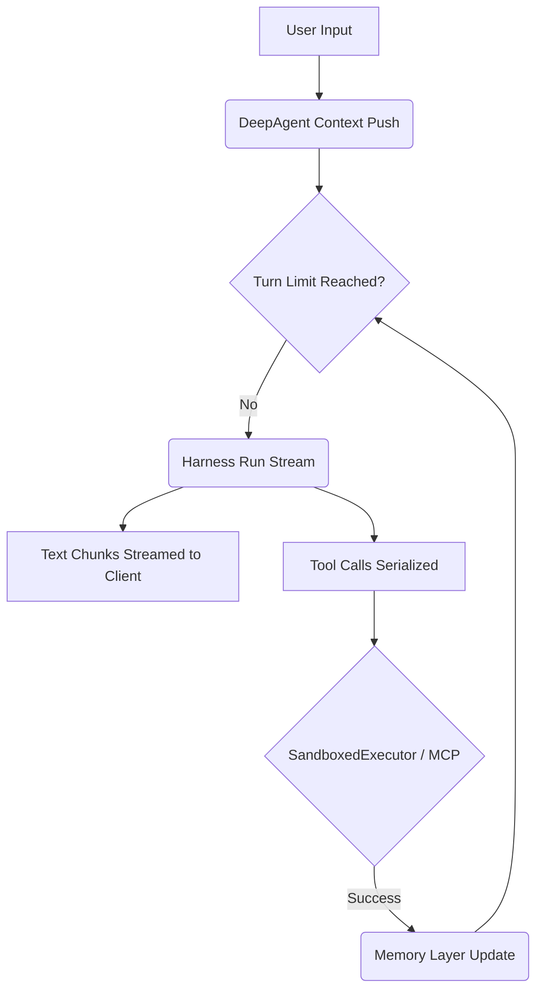

# System Architecture

The `mentalist` agent orchestrates complex language model workflows using a deeply decoupled, verifiable architecture. Our framework executes logic using safe boundaries derived directly from the source code implementation.

The core loops are handled by four major sub-engines spanning the codebase:
1. `DeepAgent` (State Machine & Reasoning loop)
2. `Harness` (LLM Provider Interface Hooks)
3. `ToolExecutor` (Sandboxing Layers)
4. `ResilientMemoryController` (Persistent Context Optimization)

## DeepAgent Loop

The `DeepAgent` (`src/agent.rs`) powers the autonomous reasoning pipeline. It models an asynchronous continuous stream.

### Request Flow
1. **Context Registration:** Incoming text is added using `Arc::make_mut` (Copy-On-Write) as a `MemoryItem` with the `User` role.
2. **Turn Limits:** The model cycles up to `StepConfig::max_turns` times (default 10) bounded by a configurable `timeout_seconds` (default 300s).
3. **Chunk Processing:** It initiates a generator stream mapping delta text directly back to the user (`AgentStepEvent::TextChunk`).
4. **Tool Activation:** If the LLM produces a signature matching a predefined tool schema, the harness serializes the string chunks into a JSON structure (`ToolCall`).

## Abstract Executors

`mentalist` utilizes a polymorhpic strategy for resolving Tools via the `MultiExecutor` and `SandboxedExecutor` structures (`src/executor.rs`).
A system can register unlimited executors implementing the unified `async fn execute` and `async fn list_tools` trait bounds.

We support mapping out tools against:
- **Local Native:** Verified OS Binaries
- **Docker Isolated:** Hosted via container mounts
- **WASM Pure Isolated:** Embedded isolated functions
- **MCP Linked:** JSON-RPC driven Model Context Protocol bridges

## Context Storage 

State is saved periodically to disk in an atomic format. Memory bounds are compressed over time via the `ResilientMemoryController`, mapping redundant arrays using recursive `brain` optimization techniques. Atomicity is achieved by writing state fragments synchronously to `.agent/sessions/.session_ID.tmp` before renaming them across the file system cleanly.
